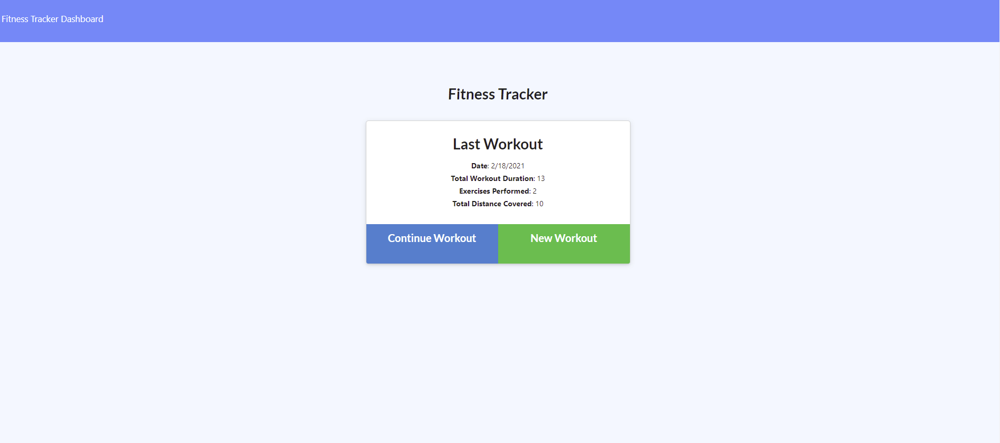
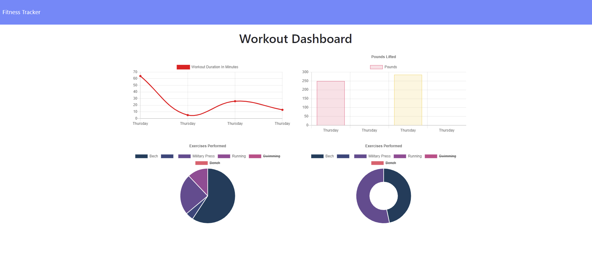

# Workout Tracker
Application can be used to track daily workouts, this app was build with Mongo database,  Mongoose schema and handle routes with Express.build. This app make it easy to view and interact with information stored in databases.

###  Workout Tracker contents:
* [User Story](#User-Story)
* [Images with application functionality](#Images-with-application-functionality)
* [Tech/framework used](#Tech/framework-used)
* [Installation](#Installation)
* [Project Link & Repository](#Project-Link-&-Repository)
* [Contributors](#Contributors)
* [License](#License)

### User Story
```
As a user, I want to be able to view create and track daily workouts. I want to be able to log multiple exercises in a workout on a given day. I should also be able to track the name, type, weight, sets, reps, and duration of exercise. If the exercise is a cardio exercise, I should be able to track my distance traveled.
```
### Images with application functionality:

|  |  |

### Tech/framework used:
* Node JS
* MongoDB
* Express
* Heroku

### Installation  
* Copy repository on your local machine
* Create a `.gitignore` file and include `node_modules/`, `.DS_Store/` so that your `node_modules` isn't uploaded to GitHub. Be sure to create your `.gitignore` file before installing any npm dependencies.
* Run npm install  in your terminal to install all dependency
* Open new terminal window and run MongoDB instance.
* Run npm start - to start the app

### Project Link & Repository
- Heroku Link- (https://workouttrackerion.herokuapp.com/?id=602f1123f9b4f50015ea2aab)
- Repository Link - (https://github.com/IonGavrilita/Workout_Tracker)

### Contributors
- Name: Ion Gavrilita
- Email: gavrilita.ion.93@gmail.com
- Github profile: https://github.com/IonGavrilita
### License
This project is licensed under MIT
[](https://opensource.org/licenses/MIT)
